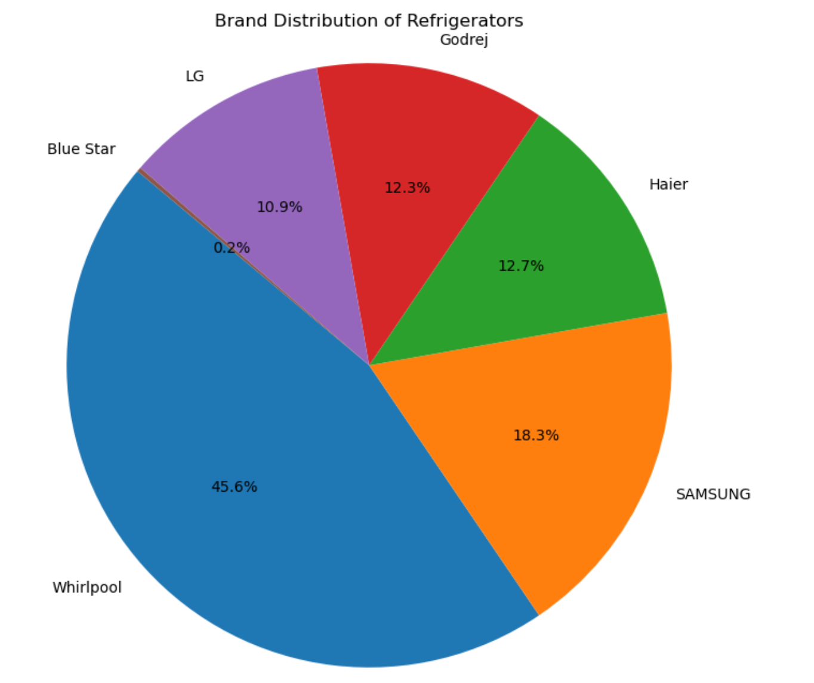
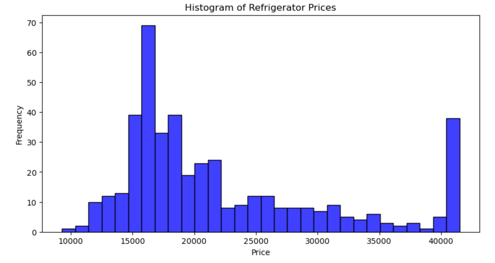
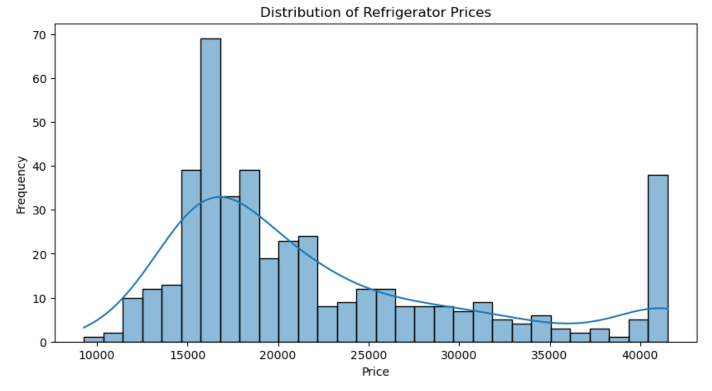

# flipkart-product-webscraping-eda

# ❄️ Flipkart Refrigerator Product EDA

## 🧠 Objective
To scrape refrigerator product data from Flipkart and perform Exploratory Data Analysis (EDA) to extract insights on pricing, brand trends, energy ratings, and customer preferences.

---

## 🛠️ Tools & Technologies
- Python
- BeautifulSoup (Web Scraping)
- Pandas (Data Handling)
- Matplotlib, Seaborn (Visualization)

---

## 📂 Dataset
I scraped over 400 refrigerator listings from Flipkart using Python and BeautifulSoup. The dataset includes:

- Product Name  
- Brand  
- Price  
- Rating  
- Number of Reviews  
- Capacity (Litres)  
- Energy Rating

---

## 📈 Key Insights

1. **Price Trends:** Most refrigerators are priced between ₹12,000 – ₹25,000.
2. **Top Brands:** Samsung, LG, and Whirlpool dominate the listings.
3. **Capacity Patterns:** 190L to 250L capacity refrigerators are most common.
4. **Energy Rating:** 3-star and 4-star rated refrigerators are the most listed.
5. **Customer Ratings:** Products with 4+ stars and 100+ reviews are highly trusted.

---

## 📊 Sample Visualizations

### 🔹 Brand Distribution

### 🔹 Price Histogram

### 🔹 Refrdgerator Price Distribution

---

## 🔍 What I Did
- Scraped product data using BeautifulSoup
- Cleaned and processed the dataset using Pandas
- Performed EDA to find trends in pricing, brand dominance, capacity, and energy efficiency
- Visualized patterns with Seaborn & Matplotlib
- Documented key findings to support e-commerce decision-making

---

## 📁 Project Files
- `EDA.ipynb`: Main notebook
- `data/flipkart.xls`: Scraped dataset
- `visuals/`: Graphs and visual output images

---

## 🔗 Connect with Me
Check out more projects on my [GitHub](https://github.com/Abhiram4u) or reach out via [LinkedIn](https://www.linkedin.com/in/abhiram06o9).
